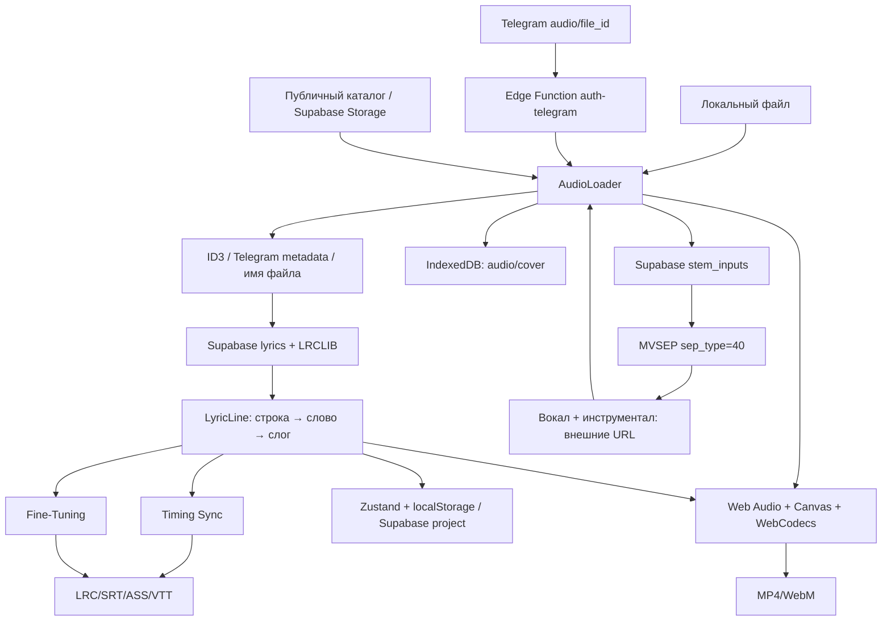

# Технический паспорт конвейера работы с треком

**Проект:** Karaoke LRC Maker
**Версия документа:** 1.2
**Дата аудита:** 17 июля 2026 года
**Область:** загрузка аудио, идентификация, поиск текста, тайминги, проекты, разделение stems и экспорт
**Основание:** статический аудит фактически исполняемого кода `src/`, Supabase Edge Functions и SQL-миграций

---

## 1. Назначение и границы документа

Этот паспорт описывает фактический путь трека в текущей версии приложения:

```text
Загрузка или получение аудио
→ извлечение метаданных
→ идентификация песни
→ поиск текста
→ поиск синхронизированного текста
→ проверка соответствия таймингов аудиофайлу
→ создание проекта
→ ручная или автоматическая разметка
→ создание минусовки и вокальной дорожки
→ экспорт
```

Документ намеренно отделяет работающий код от целевых идей из общих архитектурных документов. Упоминания Whisper, WhisperX, Demucs и собственного GPU-воркера в `src/TECH_PASSPORT_V2.md` являются проектным направлением, но не частью текущего исполняемого конвейера.

### 1.1. Обозначения статуса

| Статус | Значение |
|---|---|
| **Реализовано** | Функция присутствует в текущем исполняемом коде |
| **Частично** | Основной путь работает, но имеет существенные ограничения |
| **Не реализовано** | Исполняемого механизма в репозитории нет |
| **Предложение** | Рекомендуемое развитие, не являющееся текущей функцией |

### 1.2. Основные файлы реализации

| Область | Файлы |
|---|---|
| Загрузка и orchestration трека | `src/features/audio/AudioLoader.tsx`, `src/components/KaraokeCatalog.tsx` |
| Метаданные и обложка | `src/utils/metadata.ts`, `src/utils/cover.ts` |
| Поиск текста | `src/services/lyricsProvider.ts`, `src/services/lrclibService.ts`, `src/services/supabaseLyricsService.ts` |
| Прокси LRCLIB | `supabase/functions/lrclib/index.ts` |
| Парсинг и экспорт субтитров | `src/utils/lrc.ts`, `src/utils/subtitleFormats.ts` |
| Оценка и проверка LRC | `src/utils/lyricsMatchScore.ts`, `src/utils/lyricsValidation.ts`, `src/components/LyricsImportReviewModal.tsx` |
| Безопасный общий offset | `src/utils/timingOffset.ts`, `src/components/TimingOffsetPanel.tsx` |
| Состояние и проекты | `src/store/useKaraokeStore.ts`, `src/utils/db.ts` |
| Редакторы | `src/features/timing/TimingPanel.tsx`, `src/components/TimelineEditor.tsx`, `src/features/lyrics/LyricsTable.tsx` |
| Волна и BPM | `src/components/Waveform.tsx` |
| Разделение stems | `supabase/functions/mvsep-stems/index.ts`, `supabase/mvsep_stems.sql` |
| Видеоэкспорт | `src/features/export-video/ExportVideoPanel.tsx`, `src/utils/video.ts`, `src/utils/renderer/export.worker.ts` |

---

## 2. Резюме текущего состояния

Текущий продукт является преимущественно браузерным редактором. Аудио декодируется, waveform рассчитывается, тайминги редактируются и видео рендерится на устройстве пользователя. Supabase используется для авторизации, текстовых проектов, публикаций, проксирования LRCLIB и управления заданиями на разделение stems. Само разделение выполняет внешний сервис MVSEP.

Ключевые выводы:

1. Трек можно получить из локального файла, Telegram-вложения или опубликованного каталога. Пользовательского импорта произвольного URL нет.
2. Исполнитель и название определяются по ID3, Telegram-метаданным либо имени файла. Акустического fingerprinting нет.
3. Текст ищется в собственной базе Supabase и LRCLIB. Результаты проходят единый детерминированный ranking по metadata, duration, последней метке и маркерам версии; сомнительные результаты требуют подтверждения.
4. Автоматического offset по аудиосигналу, VAD, распознавания вокала и forced alignment нет. Реализован точный ручной offset с preview и защитой отрицательных меток.
5. Минусовка и вокал создаются внешним MVSEP через серверную очередь. Результирующий вокальный stem в текущем UI доступен как ссылка, но не включён в анализ и устойчивое локальное/серверное хранение.
6. LRC/SRT/ASS/VTT экспортируются в браузере. Видео экспортируется в MP4 или WebM через WebCodecs, с fallback на MediaRecorder.
7. Наиболее тяжёлые участки: полное декодирование аудио, расчёт waveform/BPM на главном потоке, многоступенчатая передача файла в MVSEP и браузерный видеоэнкодинг.
8. Автоподгонка найденного LRC технически возможна. Глобальный сдвиг — реалистичный первый этап; надёжная построчная подгонка имеет высокую сложность.

---

## 3. Фактическая схема потока данных



### 3.1. Где выполняются операции

| Операция | Браузер | Supabase | Сторонний сервис |
|---|:---:|:---:|:---:|
| Выбор файла и создание object URL | Да | Нет | Нет |
| Чтение ID3 и обложки | Да | Нет | Нет |
| Декодирование аудио, waveform, BPM | Да | Нет | Нет |
| Поиск собственной публикации | Клиентский запрос | PostgreSQL | Нет |
| Поиск LRCLIB | Через Edge Function | Прокси/оркестрация | LRCLIB |
| Ручная разметка | Да | Нет | Нет |
| Разделение вокала/инструментала | Нет | Очередь и передача файла | MVSEP |
| Рендер видео | Да | Нет | Нет |
| Хранение опубликованного аудио | Получение/загрузка | Storage | Нет |

---

## 4. Получение аудио

### 4.1. Локальный файл — реализовано

Пользователь выбирает файл через `<input accept="audio/*">` либо drag-and-drop в `AudioLoader`.

Проверка файла допускает:

| Расширение | Проверка приложения | Практическое условие |
|---|:---:|---|
| `.mp3` | Да | Обычно поддерживается всеми целевыми браузерами |
| `.wav` | Да | Зависит от PCM/кодека внутри WAV |
| `.ogg` | Да | Поддержка контейнера/кодека зависит от браузера |
| `.m4a` | Да | Обычно требуется AAC/ALAC, поддержка различается |
| `.aac` | Да | Зависит от браузера |
| `.flac` | Да | Зависит от браузера |

UI перечисляет не все расширения, разрешённые кодом: AAC и FLAC проходят проверку, хотя могут отсутствовать в подсказке. Финальная пригодность определяется не расширением, а способностью `HTMLAudioElement` и `AudioContext.decodeAudioData()` декодировать содержимое.

После выбора:

1. создаётся локальный `blob:` URL;
2. файл сохраняется в IndexedDB как текущее аудио;
3. читаются метаданные и обложка;
4. формируется предполагаемое название проекта;
5. при пустом тексте запускается автоматический поиск lyrics;
6. позже тот же файл может быть повторно полностью прочитан для waveform, BPM, публикации, stems и видеоэкспорта.

### 4.2. Telegram — реализовано с ограничениями

Webhook принимает `message.audio`. Для Telegram-пути действует лимит **20 МБ**. В таблицу `telegram_audio_shares` сохраняются:

- `file_id`;
- имя файла;
- размер;
- длительность;
- `performer`/artist;
- title;
- идентификатор Telegram-пользователя.

При наличии настроенного storage channel бот может переслать сообщение с аудио в канал и сохранить новый стабильный Telegram `file_id`.

Загрузка в браузер выполняется через:

```text
/functions/v1/auth-telegram?action=download-audio&file_id=...
```

Edge Function вызывает Telegram `getFile`, загружает файл целиком в память сервера и возвращает его клиенту. Подбираются MIME-типы для MP3, WAV, OGG и M4A; неизвестный тип получает MP3 по умолчанию.

Следствие: путь содержит двойную передачу и буферизацию — Telegram → Edge Function → браузер.

### 4.3. Опубликованный каталог — реализовано

Каталог может открыть:

- аудио из публичного bucket `published_audio`;
- обложку из `published_covers`;
- Telegram-аудио через прокси загрузки;
- только разметку без аудио.

Если публикация содержит lyrics, но не содержит доступного аудио, пользователь должен выбрать локальный файл. Публичный маршрут `/karaoke/:id` загружает строки, стиль и опубликованное аудио, если оно существует.

### 4.4. URL — не реализовано как пользовательская функция

Нет поля для вставки:

- прямого HTTP(S) URL на MP3;
- YouTube URL;
- Spotify/Apple Music/SoundCloud URL;
- cloud-drive URL.

Внутренние записи каталога могут содержать публичный HTTP(S) URL Supabase Storage или прокси-адрес, но это не равнозначно универсальному импорту URL пользователем.

---

## 5. Извлечение метаданных и идентификация песни

### 5.1. ID3-парсер — частично реализовано

`src/utils/metadata.ts` читает первые 5 МБ файла и поддерживает ID3v2.2, ID3v2.3 и ID3v2.4.

Извлекаются:

| Поле | ID3-фреймы |
|---|---|
| Исполнитель | `TP1`, `TPE1` |
| Название | `TT2`, `TIT2` |
| Альбом | `TAL`, `TALB` |

Поддерживаются текстовые кодировки Windows-1252/однобайтовая, UTF-16, UTF-16BE и UTF-8. Есть эвристика восстановления кириллицы Windows-1251.

Ограничения:

- нет разбора MP4 atoms для M4A;
- нет Vorbis Comments для OGG/FLAC;
- нет FLAC metadata blocks;
- нет RIFF INFO для WAV;
- нет MusicBrainz ID, ISRC и прочих внешних идентификаторов.

Поэтому качественная идентификация не-MP3 файлов часто сводится к имени файла.

### 5.2. Обложка — частично реализовано

`src/utils/cover.ts` читает первые 10 МБ, ищет ID3 APIC/PIC, а затем использует резервный поиск сигнатур JPEG/PNG. Это практично для MP3, но не является универсальным контейнерным парсером.

### 5.3. Приоритет источников artist/title

1. Для Telegram сначала используются поля performer/title из Telegram.
2. Недостающие поля дополняются ID3.
3. Для локального файла используются ID3.
4. Если метаданных нет, применяется разбор имени файла.

Имя очищается от расширения и распространённых маркеров версии: `instrumental`, `karaoke`, `cover`, `remix`, `slowed`, `reverb`, `sped up`, `nightcore`, `bass boosted`. Затем строка пытается разделиться по дефису на исполнителя и название.

### 5.4. Что не используется

**Не реализованы:** Chromaprint/AcoustID, Shazam-подобный fingerprint, MusicBrainz lookup, распознавание песни по спектру или ML. Следовательно, приложение не подтверждает, что загруженное аудио действительно соответствует найденному title/artist.

---

## 6. Поиск текста и синхронизированного текста

### 6.1. Источники

Поиск объединяет два провайдера:

1. **Supabase:** собственные `songs` и `published_karaoke`.
2. **LRCLIB:** внешний API через Supabase Edge Function.

Используются LRCLIB endpoints:

```text
https://lrclib.net/api/search?q=...
https://lrclib.net/api/get?track_name=...&artist_name=...&album_name=...&duration=...
```

Обычный поиск запускает Supabase и LRCLIB параллельно. На провайдер задан общий timeout около 25 секунд; exact lookup использует более короткий timeout около 5 секунд.

### 6.2. Автоматические поисковые запросы

Если аудио загружено, имя известно, длительность прочитана, а текст ещё пуст, `AudioLoader` формирует до четырёх вариантов:

1. `artist - title`;
2. `artist title`;
3. `title`;
4. очищенное имя файла.

Все уникальные варианты запускаются параллельно; внутри каждого запроса Supabase и LRCLIB также опрашиваются параллельно. Ответы дедуплицируются по `provider:id`, после чего ранжируются одной функцией.

### 6.3. Выбор лучшего результата

Единый механизм находится в `src/utils/lyricsMatchScore.ts`, но не сводит все проверки к одному score. Возвращаются три независимые части:

1. `textMatchScore` — только качество artist/title;
2. `versionConfidence` — только признаки соответствия версии;
3. `LyricsValidationResult` — отдельная структурная проверка распарсенных timestamps.

Generic или alignment confidence на Этапе 0 не вычисляется.

**Text match:** title даёт 60/42/22/0 за exact/partial/weak/none, artist — 40/26/14/0. Если artist исходника неизвестен, score нормализуется только по title до шкалы 0–100.

**Version confidence:** начинается со 100 и уменьшается независимо от text match:

| Признак | Изменение version confidence |
|---|---:|
| Duration неизвестна | −10 |
| Возможная тишина или другое intro/outro | −10 |
| Возможное изменение скорости | −25 |
| Вероятно другая структура/версия | −50 |
| Несовпавший version marker | −15 за маркер, максимум −45 |
| Большой trailing gap последней текстовой метки | −8 |
| Последняя текстовая метка после аудио | −12 или −25 |

Duration классифицируется именованными порогами как `close`, `possible-intro-outro`, `possible-speed-change`, `likely-different-version`. Это эвристика metadata, а не результат анализа аудиосигнала.

Анализируются `live`, `remix`, `remaster`, `radio edit`, `acoustic`, `instrumental`, `karaoke`, `cover`, `slowed`, `sped up`, `nightcore`, `reverb`, `clean`, `explicit`. Маркеры сравниваются симметрично между исходным filename/metadata и найденным результатом.

Assessment получает `good` при text match ≥88 и version confidence ≥80; `mismatch` при text match ≤49 или version confidence ≤44; остальные результаты получают `warning`. Общий статус кандидата дополнительно учитывает наличие synced lyrics и отдельный timing validation.

Автоимпорт разрешён только при synced lyrics, text match ≥88, version confidence ≥80, `validation.valid=true` и статусе validation `good`.

Стабильная сортировка: общий статус → version confidence → text match → syncedLyrics → минимальная разница длительности audio/result version → provider priority (`supabase`, `custom`, `lrclib`) → стабильный provider/id ключ. Качество распарсенных таймингов влияет через общий статус. Exact lookup больше не зависит от провайдера, ответившего первым. Прямой LRCLIB-import для Telegram-трека из каталога также проходит assessment/validation перед применением.

В ручном поиске показываются отдельные значения `T` — text match и `V` — version confidence. Сомнительный выбор открывает карточку проверки до изменения проекта.

Отдельный поток из Telegram-каталога сначала ищет точное совпадение в собственной базе по artist/title, а при отсутствии вызывает LRCLIB exact lookup с известной длительностью. Это наиболее строгий из существующих путей, но он не применяется единообразно ко всем загрузкам.

### 6.4. Кэш результатов поиска

Обычный автоматический или ручной LRCLIB-поиск не создаёт универсального локального кэша запросов.

`cacheLrcLibTrack` сохраняет LRCLIB-результат в `songs`/`published_karaoke` только в узком сценарии каталога и для авторизованного пользователя. Поэтому повторный поиск того же трека обычно снова обращается к провайдерам.

---

## 7. Поддержка форматов таймингов

### 7.1. Внутренняя модель

Базовая модель `LyricLine` поддерживает иерархию:

```text
Строка: text + time
└── слова: text + time
    └── слоги: text + time
```

Дополнительно строка может содержать перевод. Внутренняя модель выразительнее большинства поддержанных файловых импортёров.

### 7.2. Импорт

UI принимает `.lrc`, `.srt`, `.vtt`, `.ass`.

| Формат | Реальный уровень поддержки | Ограничения |
|---|---|---|
| LRC | Построчный | Стандартные метки времени; metadata tags игнорируются |
| Enhanced LRC | Частично пословный | Метки `<mm:ss.xx>`; разбор привязан к пробелам |
| SRT | Только начало cue | Время окончания теряется |
| VTT | Только начало cue, с дефектом | Двухкомпонентное `MM:SS.xxx` может распарситься как 0 из-за SRT-парсера |
| ASS/SSA | Только текст и начало dialogue | Style-теги и karaoke-теги `\k` удаляются; пословные тайминги теряются |

Дополнительные ограничения LRC:

- несколько timestamp-тегов у одной строки не поддерживаются корректно;
- offset metadata не применяется как автоматическая коррекция;
- структура и грубое соответствие длительности проверяются; семантическое соответствие текста аудио без ASR не проверяется;
- слоговые тайминги напрямую из LRC не восстанавливаются как отдельная полноценная схема.

### 7.3. Экспорт

| Формат | Статус | Реальное поведение |
|---|---|---|
| LRC | Работает | Построчные метки; при наличии word timing добавляются enhanced word tags |
| SRT | Работает | Конец cue = начало следующей строки, у последней строки +4 секунды |
| VTT | Работает | Аналогичное вычисление конца cue |
| ASS | Работает | Пословные длительности генерируются как `\k` в сотых долях секунды |
| ZIP проекта | Код есть, UI не подключён | `src/utils/sharing.ts` умеет архивировать/импортировать проект, но штатного пользовательского потока нет |

Экспорт означает успешное создание файла браузером, но не гарантирует round-trip без потерь: SRT/VTT не хранят исходные окончания строк, ASS import удаляет karaoke tags, а слоговая структура не сериализуется одинаково во все форматы.

---

## 8. Проверка соответствия таймингов конкретному аудио

### 8.1. Текущее состояние

До импорта найденного или локального синхронизированного текста выполняется структурированная проверка `validateLyricsTimings`:

- наличие и количество размеченных строк;
- отрицательные timestamps на line/word/syllable уровнях;
- timestamps после конца аудио;
- первая и последняя line timestamp относительно длительности;
- возрастающий порядок строк;
- массовые одинаковые line timestamps;
- абсолютное и относительное расхождение audio/result duration.

Проверка не меняет timestamps. Она возвращает `valid`, status, warnings, `timedLineCount`, `untimedLineCount`, negative/out-of-range/duplicate/non-monotonic counts, а также `firstTimestamp` и `lastTimestamp`. Для `warning`/`mismatch` показывается карточка с metadata, источником, длительностью аудио, длительностью версии результата, разницей, text match и version confidence.

По-прежнему не выполняются:

- определение длины вступления и первого вокала;
- поиск пауз и вокальных границ;
- обнаружение time stretch;
- поиск вырезанных/добавленных куплетов;
- выявление live/remix/radio/acoustic версии по аудиосигналу.

### 8.2. Несовпадение версий

Metadata/duration/structure mismatch классифицируется как `warning` или `mismatch`. Низкий text match, низкий version confidence или невалидные timestamps блокируют автоматический импорт, но пользователь может явно принять LRC, выбрать другой результат либо перейти к ручной разметке. Аудиосигнальное подтверждение версии отсутствует.

Типовые случаи:

| Несовпадение | Текущее поведение |
|---|---|
| Другое вступление | Все строки остаются смещёнными |
| Radio edit / удалённый куплет | Тайминги после структурного изменения расходятся |
| Slowed/sped-up | Ошибка постепенно растёт по длине трека |
| Live/acoustic | Возможны локальные и структурные расхождения |
| Другая тишина в начале | Требуется глобальный сдвиг |

### 8.3. Offset

**Автоматического offset нет.** Реализован точный ручной ввод с шагом 0.001 секунды, быстрые инкременты ±0.1/±0.2/±0.5, reset, preview первой/последней метки и прослушивание до/после.

Preview не мутирует проект. Применение сдвигает line, word и syllable timestamps и создаёт одну запись Zustand history.

Если после отрицательного сдвига хотя бы одна метка оказывается раньше нуля, обычное применение блокируется. UI показывает минимальную метку после сдвига, общие и раздельные line/word/syllable counts, количество отрицательных меток и максимально безопасный отрицательный offset. Доступны отмена, ограничение до безопасного offset и явное применение с обрезкой. Только последний подтверждённый вариант обрезает отрицательные значения до нуля.

Beat snapping не является автокоррекцией offset: он только магнитит пользовательский tap/drag к ближайшему биту в небольшом временном окне.

---

## 9. Создание и хранение проекта

### 9.1. Когда создаётся проект

Загрузка аудио не гарантирует создание устойчивой серверной сущности. Пользователь работает с текущим состоянием Zustand, а проект фиксируется при явном сохранении черновика либо публикации.

### 9.2. Local state и localStorage

Zustand persist использует ключ:

```text
karaoke-lrc-maker-storage
```

Сохраняются, среди прочего:

- текущий шаг;
- сырой текст и `lines`;
- имя аудиофайла;
- title/id проекта;
- тема и video style;
- режим таймингов;
- настройки snap, syllable/sub mode;
- список недавних проектов.

Не сохраняются устойчиво в Zustand persist:

- `audioUrl`;
- `coverUrl`;
- waveform peaks;
- декодированный `AudioBuffer`;
- BPM/beats текущего анализа;
- состояние задания stems;
- URL вокального/инструментального stem.

### 9.3. IndexedDB

База:

```text
karaoke_lrc_maker_db
```

Object store:

```text
audio_store
```

Ключи включают:

- `current_audio`;
- `current_cover`;
- `project:{id}:audio`;
- `project:{id}:cover`.

Файлы хранятся как Blob локально на конкретном устройстве и профиле браузера. Очистка данных сайта, квоты Safari/iOS и приватный режим могут привести к потере локальных медиа.

### 9.4. Supabase projects

Серверный проект хранит lyrics lines, video style, title и имя аудиофайла, но не обязан хранить сам аудиофайл. При открытии cloud-проекта приложение:

1. пытается найти локальный Blob по project id;
2. при отсутствии пытается сопоставить имя с Telegram share и загрузить файл заново;
3. иначе открывает проект без аудио.

То есть облачная синхронизация разметки не равна полной переносимости проекта между устройствами.

### 9.5. Публикация

При публикации могут использоваться:

| Данные | Место |
|---|---|
| Аудио | Supabase Storage `published_audio` |
| Обложка | Supabase Storage `published_covers` |
| Строки и стили | PostgreSQL `published_karaoke` |
| Artist/title/album/duration/BPM/beats | PostgreSQL `songs` |

---

## 10. Ручная и автоматическая разметка

### 10.1. Timing Sync

`TimingPanel` предназначен для первичной записи таймингов во время прослушивания.

Поддерживаются режимы:

1. **Line:** tap/Space назначает время следующей строке; также инициализирует первую дочернюю word/syllable метку.
2. **Word:** последовательные нажатия назначают времена словам.
3. **Syllable:** последовательные нажатия назначают времена слогам.

Инструменты:

- Space или большая tap-зона;
- play/pause;
- seek назад/вперёд на 2 секунды;
- undo последней метки;
- полный reset;
- общие undo/redo;
- мобильная крупная зона нажатия.

Разделение слов на слоги выполняется текстовыми эвристиками, а не анализом вокала. Это автоматизация подготовки структуры, но не автоматическая аудиосинхронизация.

### 10.2. Fine-Tuning

Точная правка состоит из нескольких частей.

**LyricsTable:**

- прямое редактирование текста, перевода и времени;
- глобальный и построчный сдвиг;
- микротайминги слов;
- split/merge строк;
- удаление и перестановка.

**TimingOffsetPanel:**

- точность до 0.001 секунды;
- preview без мутации;
- первая/последняя метка до и после;
- прослушивание с позиции за 2 секунды до сравниваемой первой метки;
- атомарный Apply/Undo;
- защита от неявной обрезки отрицательных line/word/syllable timestamps.

**TimelineEditor:**

- показывает точки/блоки начала уже размеченных строк;
- позволяет перетаскивать их по длительности трека;
- магнитит к beats или к другой строке примерно в пределах 220 мс;
- не показывает полноценный waveform внутри дорожки;
- не имеет диапазонов начала/конца фраз;
- использует мышиные события, а не единый Pointer API;
- не рассчитан на профессиональную работу с zoom/range/многодорожечностью.

Во время drag могут создаваться многочисленные снимки history, что увеличивает расход памяти.

### 10.3. Waveform и спектральные данные

`Waveform`:

1. загружает аудио целиком;
2. декодирует его через Web Audio API;
3. использует первый канал;
4. рассчитывает до 1200 peak-значений;
5. оценивает BPM по энергетическим блокам.

Важно: отображаемый режим «spectrogram» не выполняет FFT и не является настоящей спектрограммой. Визуальная высота формируется из waveform и синусоидальной эвристики. Его нельзя использовать как источник доказательств для обнаружения согласных, вокала или фраз.

### 10.4. Автоматическая разметка

Автоматизация включает детерминированный выбор, структурную проверку и безопасный быстрый импорт высокоуверенного LRC. Аудиоанализ и автоматическая коррекция отсутствуют. Нет:

- ASR;
- Whisper/WhisperX;
- forced alignment;
- vocal activity detection;
- pitch/voicing анализа;
- автоматической постановки line/word/syllable timestamps по аудио.

---

## 11. Создание минусовки и вокальной дорожки

### 11.1. Сервис и модель

Используется сторонний сервис **MVSEP**. Клиент передаёт:

```text
sep_type = 40
output_format = 0
```

В документации интеграции `sep_type=40` обозначен как **BS Roformer (vocals, instrumental)**, а `output_format=0` — MP3 320 kbps.

Ни Demucs, ни HTDemucs, ни локальная ONNX-модель в текущем исполняемом коде не запускаются.

### 11.2. Где выполняется разделение

Разделение выполняется **не в браузере и не непосредственно в Supabase**, а на стороне MVSEP. Supabase Edge Function оркестрирует очередь и скрывает API token.

Фактический путь:

```text
Браузер
→ multipart upload в mvsep-stems Edge Function
→ private bucket stem_inputs
→ Edge Function повторно скачивает input
→ upload в MVSEP
→ обработка MVSEP
→ polling status
→ внешние result URL вокала и инструментала
→ браузер скачивает выбранный результат
```

### 11.3. Доступ и очередь

Функция доступна Plus/Pro/Admin. Задания хранятся в `song_stems` со статусами:

```text
queued → submitting → waiting → processing
→ distributing → merging → completed
```

Также возможны `failed` и `cancelled`.

Конкурентность читается из `telegram_bot_settings.mvsep_max_concurrent_jobs`, по умолчанию равна 1 и ограничена максимумом 10.

В репозитории нет самостоятельного непрерывного worker/cron, который гарантированно прокачивает очередь. Она продвигается при create, refresh или admin pump. При отсутствии клиентского refresh queued job может ожидать дополнительного вызова.

### 11.4. Что происходит с результатом

`result_files` сохраняются как JSON в `song_stems`. UI ищет:

- файл, тип которого содержит `vocal`;
- файл, тип которого содержит `other` или `instrumental`.

**Вокальный stem:** отображается как внешняя ссылка. Он не скачивается автоматически, не кэшируется, не воспроизводится отдельной дорожкой и не анализируется.

**Инструментал:** браузер пытается скачать внешний URL, создать `File`, заменить текущее аудио проекта и сохранить его как `current_audio` в IndexedDB. Lyrics/timings сохраняются без проверки новой длительности.

### 11.5. Хранение stems

SQL создаёт private buckets `stem_inputs` и `stem_results`, а схема содержит `vocal_storage_path` и `instrumental_storage_path`. Однако текущая Edge Function:

- сохраняет входной файл в `stem_inputs`;
- не копирует MVSEP outputs в `stem_results`;
- не заполняет устойчиво storage path результатов;
- не реализует lifecycle cleanup входов и результатов.

Итоговые stems зависят от внешних result URL MVSEP и их срока жизни/CORS-доступности.

Состояние текущего `stemJob` живёт в локальном состоянии React. После reload UI не восстанавливает активное задание автоматически и не показывает полноценную историю заданий.

---

## 12. Что кэшируется и где хранится

| Объект | Где хранится | Переживает reload | Переносится между устройствами |
|---|---|:---:|:---:|
| Текущий audio Blob | IndexedDB | Да | Нет |
| Текущая cover Blob | IndexedDB | Да | Нет |
| Audio/cover проекта | IndexedDB по project id | Да | Нет |
| Lyrics/timings текущего состояния | Zustand persist/localStorage | Да | Нет |
| Серверный проект lyrics/style | Supabase PostgreSQL | Да | Да |
| Аудио серверного draft | Обычно нигде | Нет гарантии | Нет гарантии |
| Опубликованное аудио | `published_audio` | Да | Да |
| Опубликованная обложка | `published_covers` | Да | Да |
| Telegram-аудио | Telegram/file_id | Да при валидном file_id | Да через прокси |
| Waveform peaks | React memory | Нет | Нет |
| Декодированный PCM | Memory/worker | Нет | Нет |
| BPM/beats текущего анализа | Runtime state | Не гарантируется | Нет |
| MVSEP input | `stem_inputs` | Да до ручной/будущей очистки | Серверно |
| MVSEP output | Внешний URL в `song_stems.result_files` | Пока URL валиден | Ненадёжно |
| Renderer text/background caches | JS Maps/offscreen canvas | Нет | Нет |
| LRCLIB query result | Обычно не кэшируется | Нет | Нет |

Renderer кэширует измерения ширины текста, prerendered text и offscreen/background canvases. Эти кэши очищаются при изменении стиля/качества и существуют только во время сессии.

---

## 13. Экспорт

### 13.1. Текстовые форматы

LRC, SRT, ASS и VTT создаются полностью в браузере как Blob и скачиваются через временный object URL. Серверный рендеринг для этих форматов не используется.

### 13.2. Видеоэкспорт: основной путь WebCodecs

Основной офлайн-конвейер:

```text
fetch полного аудио
→ decodeAudioData в полный AudioBuffer
→ передача PCM каналов в Web Worker
→ OffscreenCanvas кадры
→ VideoEncoder + AudioEncoder
→ mp4-muxer или webm-muxer
→ финальный ArrayBuffer
→ Blob
→ download
```

Поддерживаемые конфигурации:

| Контейнер | Видео | Аудио |
|---|---|---|
| MP4 | H.264/AVC | AAC |
| WebM | VP9 или VP8 | Opus |

Настройки UI включают 720p/1080p, 16:9/9:16/1:1, 24/30/60 FPS и bitrate.

Fallback-цепочка приблизительно такова:

```text
MP4 H.264 hardware
→ MP4 H.264 software
→ offline WebM
→ real-time MediaRecorder
```

### 13.3. MediaRecorder fallback

Fallback захватывает `canvas.captureStream()` вместе с аудио через `MediaStreamDestination`. Рендер идёт в реальном времени, поэтому экспорт трека длительностью 4 минуты занимает не менее примерно 4 минут.

Сначала проверяются MP4 MIME-типы, затем WebM VP9/VP8. Расширение скачиваемого файла определяется фактическим MIME Blob, поэтому неуспешный MP4 может корректно превратиться в `.webm`.

### 13.4. Ограничения видеоэкспорта

- MP4 capability check не полностью гарантирует доступность AAC `AudioEncoder`.
- В offline worker фоновое пользовательское видео не передаётся как полноценный `bgVideo`; такой фон может отсутствовать в офлайн-результате.
- И compressed audio, и PCM, и кадры/очереди encoder, и финальный output находятся в памяти.
- Muxer работает с in-memory fast start, что повышает пик RAM.
- В worker аудиоочереди многократно копируются/обрезаются, создавая CPU/GC нагрузку.
- Визуализатор в offline worker не использует полноценный FFT; fallback может использовать синтетические значения.
- Качество и поддержка кодеков зависят от браузера и аппаратного декодера/энкодера.

---

## 14. Ограничения мобильных устройств

1. На ширине менее 768 px приложение переключает упрощённый karaoke-oriented режим.
2. Timing Sync имеет большую tap-зону и в целом пригоден для мобильной разметки.
3. TimelineEditor использует mouse events; полноценный touch/pointer drag не гарантирован.
4. HTML5 drag-and-drop строк в таблице нестабилен на мобильных браузерах.
5. Ctrl+wheel zoom недоступен как естественный жест; таблицы требуют горизонтального скролла.
6. WebCodecs, H.264 encoding и особенно AAC AudioEncoder поддерживаются неодинаково. Частый исход — MediaRecorder real-time.
7. Блокировка экрана, уход приложения в фон и выгрузка вкладки ОС могут остановить real-time export.
8. Полный compressed file, PCM, canvas, encoder queue и output Blob одновременно создают высокий пик памяти. 1080p/60 FPS особенно рискован.
9. IndexedDB квоты и политика очистки Safari/iOS делают локальные проекты менее надёжными.
10. Telegram import ограничен 20 МБ независимо от возможностей браузера.
11. На iOS обычная ссылка download может открыть preview/share sheet вместо прямого сохранения.

---

## 15. Основные задержки и нагрузка

### 15.1. Загрузка и восстановление

- локальный файл целиком пишется в IndexedDB;
- для ID3 читаются первые 5 МБ;
- для cover — до 10 МБ;
- waveform снова получает и декодирует полный файл;
- Telegram-путь буферизует файл в Edge Function и затем в браузере.

### 15.2. Поиск lyrics

- один запрос одновременно идёт в Supabase и LRCLIB;
- до четырёх уникальных вариантов запроса выполняются параллельно, что сокращает wall-clock latency, но увеличивает число одновременных обращений;
- внешний LRCLIB проходит через Edge proxy;
- универсального query cache нет;
- в плохой сети ожидание определяется самым медленным параллельным запросом; возможны rate-limit и повышенная нагрузка на LRCLIB/Supabase.

### 15.3. Waveform/BPM

- полный `decodeAudioData` создаёт несжатый PCM;
- проходы по аудиоканалу выполняются в браузере;
- BPM energy scan и peak aggregation могут блокировать главный поток;
- результаты waveform не переиспользуются между reload.

### 15.4. Stems

Наиболее длинный сетевой путь:

```text
browser upload
→ Supabase Storage
→ Edge download
→ MVSEP upload
→ queue/GPU processing
→ polling
→ browser result download
```

По умолчанию одновременно работает одно MVSEP-задание. Время обработки зависит от очереди внешнего сервиса и длительности трека. Повторные передачи исходного файла увеличивают latency и bandwidth.

### 15.5. Видео

- полное декодирование аудио;
- Canvas-отрисовка каждого кадра;
- H.264/VP9 encoding;
- 1080p и 60 FPS кратно увеличивают число пикселей/кадров;
- PCM copy и GC в worker;
- финальный файл собирается в памяти;
- MediaRecorder занимает реальную длительность песни.

### 15.6. Редактор

Частые drag updates могут создавать множество history snapshots. На больших lyrics и слабом устройстве это добавляет память и повторные React render.

---

## 16. Техническая возможность автоподгонки LRC под загруженный аудиофайл

### 16.1. Итоговая оценка

Подготовительный этап реализован: раздельные text match/version assessment/timing validation, review-card и безопасный ручной global offset. Alignment confidence не вычисляется, поскольку анализа аудиосигнала ещё нет. Автоматического вычисления offset и построчной коррекции этот этап намеренно не содержит.

Функция технически возможна, но имеет разные уровни сложности:

| Уровень | Оценка |
|---|---|
| Ручной глобальный offset с улучшенным UI | Реализовано |
| Предложение глобального offset по вокальным onset | Средняя |
| Надёжная глобальная коррекция с confidence/version gate | Средняя |
| Построчное выравнивание по фразам | Высокая |
| Пословный/фонемный forced alignment для пения | Высокая |
| Универсальная подгонка разных edit/live/remix версий | Высокая, без гарантии полного успеха |

Для production-функции «подогнать найденный LRC именно к этому файлу» общая оценка — **высокая**, потому что система должна отличать простой сдвиг от изменения скорости и структуры.

### 16.2. Существующие компоненты, которые можно использовать

| Компонент | Как использовать |
|---|---|
| `AudioContext.decodeAudioData` из Waveform/video | Получение mono PCM для анализа |
| Energy blocks из BPM-детектора | Основа для общей envelope/VAD utility после рефакторинга |
| `LyricLine` | Вход и результат предложения коррекции |
| `shiftAllTimings` | Атомарно применяет проверенный global offset к line/word/syllable |
| Zustand history/undo | Откат коррекции одной операцией |
| LRCLIB duration + `<audio>.duration` | Быстрая проверка версии |
| MVSEP vocal result | Более чистый сигнал для поиска вокальных фраз |
| TimelineEditor/LyricsTable | Preview и ручное подтверждение поправок |
| IndexedDB | Кэширование скачанного vocal stem и анализа |
| Web Worker архитектура export | Шаблон вынесения signal processing с main thread |
| `song_stems` | Основа серверной очереди получения вокала |

Нельзя использовать как реальный анализ:

- декоративную «spectrogram» в `Waveform`;
- синтетический FFT/визуализатор видео;
- beat detector как прямое доказательство начала строк;
- инструментальный stem вместо vocal stem.

### 16.3. Доступна ли вокальная дорожка

**Да, потенциально доступна после успешного MVSEP separation.** `result_files` содержит отдельный vocal output, и UI умеет распознать его по типу.

Но для автоподгонки текущей доступности недостаточно:

- URL внешний и может истечь;
- vocal не скачивается автоматически;
- CORS может запретить browser fetch/decode;
- vocal не хранится в `stem_results`;
- job state теряется после reload;
- нет связи stem с конкретным локальным проектом и версии исходного аудио;
- нет кэша PCM/features.

Перед надёжным анализом рекомендуется копировать vocal в private `stem_results`, сохранять storage path и project/source fingerprint, а клиенту выдавать подписанный URL.

### 16.4. Можно ли находить начало и границы вокальных фраз

Да, с ограниченной надёжностью даже без ASR:

1. декодировать vocal stem в mono PCM;
2. разбить на окна 20–50 мс;
3. рассчитать RMS или log-energy;
4. оценить noise floor адаптивным percentile/median;
5. применить порог, smoothing и hysteresis;
6. заполнить короткие паузы порядка 200–500 мс;
7. удалить слишком короткие импульсы;
8. получить интервалы `[onset, end]` вокальной активности.

Это будет **voice activity segmentation**, а не распознавание конкретной строки. Алгоритм не знает, где какая фраза текста, и может принять за фразу:

- вдох;
- бэк-вокал;
- адлиб;
- count-in;
- leakage инструмента;
- длинный reverb tail.

Для улучшения нужны singing voice VAD, voicing/pitch признаки либо ASR/forced alignment.

### 16.5. Лучшее место в конвейере

Рекомендуемый этап:

```text
Найден synced LRC
→ parse в LyricLine[]
→ duration/version precheck
→ получение или создание vocal stem
→ анализ вокальной активности
→ вычисление предложения коррекции
→ preview: исходные и предложенные тайминги + confidence
→ Apply / Cancel
→ Timing Sync или Fine-Tuning
```

Не следует незаметно менять timestamps сразу при выборе результата поиска. До анализа пользователь должен видеть, что импортирован оригинальный LRC; после анализа — величину и качество предложенной коррекции.

### 16.6. Обязательная предварительная проверка версии

До коррекции нужно вычислять:

- `abs(audioDuration - lrcDuration)`;
- отличие `audioDuration` от LRCLIB duration;
- последнюю LRC-метку относительно конца аудио;
- долю меток `< 0` или `> audioDuration`;
- медианное расстояние между строками;
- маркеры `live`, `remix`, `edit`, `slowed`, `sped up`, `acoustic`, `instrumental` в metadata/filename;
- наличие достаточного числа вокальных интервалов.

Если различие длительности велико, простой offset следует блокировать и показывать предупреждение «возможно, другая версия трека».

### 16.7. Первый этап: глобальный сдвиг

Начать с глобального сдвига можно и целесообразно.

Наивная формула:

```text
offset = firstDetectedVocalOnset - firstLrcTimestamp
```

Она недостаточно надёжна из-за адлибов, count-in и бэк-вокала.

Более устойчивый вариант без большой ML-модели:

1. представить начала строк LRC как временные импульсы;
2. представить найденные начала вокальных фраз как второй ряд импульсов;
3. перебрать lag, например от −15 до +30 секунд;
4. начислять баллы за совпадения нескольких line starts с phrase onsets;
5. штрафовать слишком большой shift и немонотонные остаточные ошибки;
6. требовать минимальное число совпадений;
7. рассчитать confidence и показать preview;
8. применять offset одной атомарной операцией с undo.

Критерии безопасного MVP:

- не применять автоматически без подтверждения;
- хранить исходные тайминги;
- иметь minimum confidence;
- иметь max allowed offset;
- не схлопывать отрицательные timestamps молча;
- показывать разницу длительности и число совпавших фраз.

### 16.8. Что требуется для построчной подгонки

Минимальный signal-only подход:

1. получить интервалы вокальных фраз;
2. сопоставить LRC line starts и phrase onsets монотонным алгоритмом;
3. допустить пропуски LRC-строк и дополнительные acoustic segments;
4. использовать dynamic programming/DTW;
5. ограничить максимальную локальную поправку;
6. добавить smoothness/tempo regularization;
7. вычислять confidence каждой строки;
8. не менять строки с низкой уверенностью;
9. определить политику word timing: сохранять относительные offsets или локально масштабировать.

Для более надёжного решения:

```text
известный текст + vocal stem
→ singing ASR / phoneme recognition
→ CTC или forced alignment
→ word/phoneme timestamps
→ regroup в исходные строки
```

Это потребует GPU или внешнего ML API. Supabase Edge Function подходит для авторизации и постановки job, но не для длительного GPU inference. Нужен отдельный worker/provider, хранение job state и тарификация/лимиты.

### 16.9. Файлы, которые потребуется изменить

#### Браузерный MVP глобального offset

| Файл | Изменение |
|---|---|
| `src/features/audio/AudioLoader.tsx` | Запуск проверки после импорта synced LRC; получение vocal result |
| `src/store/useKaraokeStore.ts` | Alignment proposal, original timings, confidence, атомарный Apply/Undo |
| `src/types.ts` | Типы `AlignmentProposal`, `PhraseSegment`, per-line correction |
| `src/components/Waveform.tsx` | Вынести decode/envelope из UI-компонента в общую utility |
| `src/utils/vocalActivity.ts` | Новый RMS/VAD анализ и phrase segmentation |
| `src/utils/lyricsAlignment.ts` | Новый global lag scoring и version gates |
| `src/features/timing/TimingPanel.tsx` | Preview/status/apply/cancel |
| `src/features/lyrics/LyricsTable.tsx` | Визуализация исходного и предложенного времени |
| `src/components/TimelineEditor.tsx` | Overlay proposed markers и confidence |
| `src/utils/db.ts` | Кэш vocal stem/features по fingerprint исходника |

#### Устойчивое хранение vocal stem

| Файл | Изменение |
|---|---|
| `supabase/functions/mvsep-stems/index.ts` | Серверно скачать output MVSEP, загрузить в `stem_results`, вернуть signed path |
| `supabase/mvsep_stems.sql` | Project/source binding, storage paths, checksum, lifecycle/cleanup |
| Новая миграция | Alignment jobs/results, если анализ станет серверным |

#### ML/forced alignment

Потребуются новая Edge Function для orchestration, отдельный GPU worker или API, таблица заданий alignment, лимиты тарифа, логирование model/version и политика удаления аудио/feature artifacts.

### 16.10. Риски ложной коррекции

| Риск | Последствие |
|---|---|
| Адлиб до первой строки | Неверный global offset |
| Count-in или разговор | Ложное начало вокала |
| Бэк-вокал/дуэт | Лишние phrase segments |
| Leakage после separation | Инструменты распознаются как голос |
| Reverb tail | Завышенная граница конца фразы |
| Slowed/sped-up | Ошибка растёт; shift не помогает |
| Radio edit/вырезанный куплет | После точки монтажа ломается всё сопоставление |
| Повторяющиеся припевы | Неоднозначное соответствие |
| Live/acoustic версия | Темп и структура локально отличаются |
| LRC показывает строку заранее | Акустический onset систематически позже намеренного display time |
| Одна LRC-строка = несколько вокальных фраз | Ошибка сегментации |
| Несколько строк на одной музыкальной фразе | Ошибка сопоставления |
| Буквенная транслитерация/другой язык | ASR alignment ухудшается |
| Слишком мало строк | Низкая статистическая уверенность |
| Большой отрицательный shift | Схлопывание ранних меток в 0 |
| Готовые word timings | Грубая line correction может разрушить качественную внутреннюю разметку |

### 16.11. Защитные меры

1. Никогда не применять коррекцию скрыто.
2. Показывать preview и confidence.
3. Сохранять оригинал и делать одно undoable действие.
4. Блокировать global shift при явном duration mismatch.
5. Ограничивать глобальный и построчный сдвиг.
6. Не корректировать строки ниже confidence threshold.
7. Показывать предупреждение о вероятно другой версии.
8. Позволять применить коррекцию к выбранному диапазону.
9. Логировать algorithm/model version для воспроизводимости.
10. Не использовать декоративную spectrogram как вход алгоритма.

---

## 17. Состояние этапов и дальнейшее развитие

### Этап 0 — диагностика и ручной offset, реализовано

- сравнение duration;
- проверка последней метки;
- out-of-range timestamps;
- предупреждение о возможной другой версии;
- улучшенный ручной offset preview;
- review-card и атомарный Apply/Undo.

### Этап 1 — global offset по vocal activity, сложность средняя

- устойчивое получение vocal stem;
- RMS/VAD в Web Worker;
- lag scoring по нескольким фразам;
- confidence;
- ручное Apply/Cancel.

### Этап 2 — построчная signal-only подгонка, сложность высокая

- phrase segmentation;
- monotonic DP/DTW;
- per-line confidence;
- ограничения локального warp;
- UI сравнения и выборочного применения.

### Этап 3 — forced alignment, сложность высокая

- singing-capable ASR/acoustic model;
- GPU worker/API;
- word/phoneme alignment;
- regroup строк;
- мониторинг качества по языкам и жанрам.

---

## 18. Заключение

Текущий конвейер уже содержит необходимые строительные блоки для первого прототипа автокоррекции: декодирование аудио, внутреннюю модель таймингов, MVSEP vocal stem, глобальный сдвиг, history и редакторы preview. Главный отсутствующий слой — настоящий анализ вокального сигнала и устойчивое хранение vocal outputs.

Реализован безопасный подготовительный слой **alignment assistant**:

```text
проверка metadata/duration/структуры
→ ручной preview global offset
→ отдельные text match и version confidence
→ визуальное сравнение
→ подтверждение пользователя
```

Следующий отдельный этап, не входящий в текущую реализацию, — вычисление предложения offset по реальному вокальному сигналу.

Такой этап даст измеримую пользу с умеренной сложностью. Построчное выравнивание без распознавания текста возможно, но будет эвристическим. Надёжная пословная синхронизация вокала требует отдельного ML/forced-alignment конвейера и должна оцениваться как высокосложная функция.

---

## 19. Ограничения аудита

Паспорт основан на статическом анализе репозитория. Фактическая совместимость кодеков, CORS внешних MVSEP URL, квоты IndexedDB, доступность WebCodecs и поведение Edge Functions зависят от браузера и конфигурации развёрнутого окружения.

После реализации подготовительного этапа выполнены `npm run typecheck` и `npm run build`; обе команды завершились успешно. Production build Vite 8 сформировал single-file `dist/index.html` размером около 844 КБ (gzip около 219 КБ). Интерактивные сценарии браузера и особенности мобильных кодеков требуют отдельной ручной проверки.
