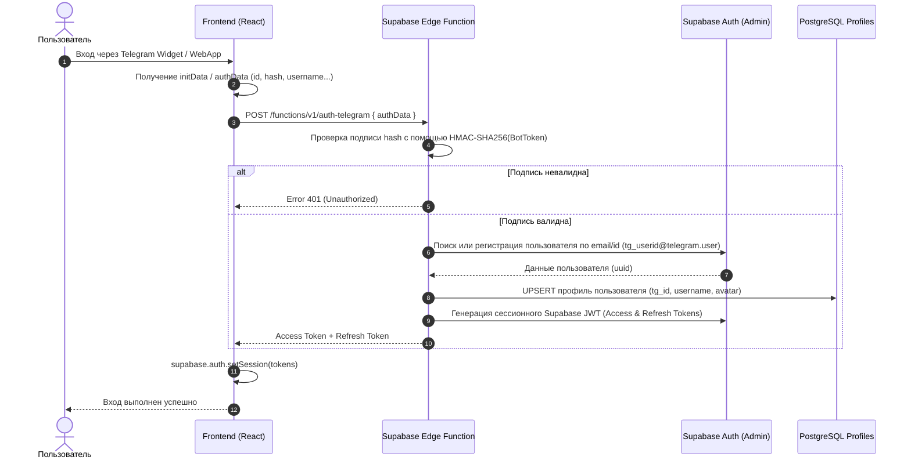
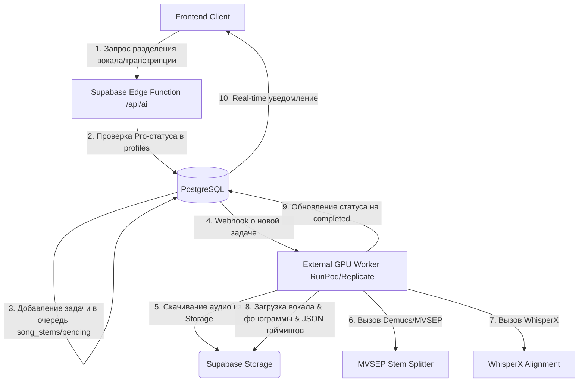

# 🏛 АРХИТЕКТУРА V2: ОБЛАЧНЫЙ СЕРВИС “Karaoke LRC Maker”

Настоящий документ описывает архитектуру версии V2 для перехода проекта от локального веб-редактора к полноценной облачной SaaS-платформе с личными кабинетами, синхронизацией проектов, публичной библиотекой караоке и инфраструктурным заделом под Pro AI-функции.

---

## 1. Общий дизайн-концепт и концепция Zero-Cost MVP

Основная цель V2 — развертывание масштабируемого сервиса с минимальными затратами. В качестве бэкенда используется платформа **Supabase (PostgreSQL + Auth + Storage + Edge Functions)**.

Для сохранения бесплатного тарифа (Free Tier) Supabase на этапе MVP вводятся следующие архитектурные ограничения и решения:
* **Лимит базы данных (500 MB):** Все тексты песен, пословная/послоговая разметка, переводы и стили видео хранятся в формате `JSONB` в СУБД PostgreSQL. Текстовые данные занимают крайне мало места (один проект ~5-15 KB), что позволяет хранить до 30 000–50 000 проектов в лимите 500 MB.
* **Лимит хранилища Storage (1 GB):**
  * **Черновики (Drafts):** Для личных незавершенных проектов аудиофайлы (.mp3) и оригинальные обложки **не загружаются на облачный сервер**. Они продолжают кэшироваться локально в браузере пользователя через `IndexedDB` (как в версии V1). В облако синхронизируется только текстовая разметка и конфигурация стиля. Это дает неограниченное дисковое пространство для черновиков пользователей при нулевых расходах на Storage.
  * **Публикации (Public Library):** При публикации трека в общий каталог аудиофайл загружается в бакет `Supabase Storage`. При этом на стороне клиента происходит принудительное сжатие аудио в MP3 (128 kbps, ~3 MB на песню) и обложки в формат WebP (400x400 пикселей, ~50 KB). Это позволяет опубликовать более 300 полноценных караоке-треков в рамках бесплатного гигабайта, прежде чем потребуется переход на платный тариф.

---

## 2. Интеграция Auth: Авторизация через Telegram

Авторизация реализуется через бесшовную интеграцию Telegram Login Widget (для веб-сайта) или Telegram WebApp Auth (для запуска внутри мессенджера) с Supabase Auth посредством валидации хэша на Supabase Edge Functions.

### Схема взаимодействия (Auth Flow):


### Реализация проверки подписи (Edge Function):
Пример проверки хэша Telegram на стороне Supabase Edge Function (Deno):
```typescript
import { crypto } from "https://deno.land/std/crypto/mod.ts";

async function verifyTelegramHash(authData: Record<string, any>, botToken: string): Promise<boolean> {
  const { hash, ...data } = authData;
  
  // 1. Сортируем ключи по алфавиту и собираем в строку key=value
  const dataCheckString = Object.keys(data)
    .sort()
    .map(key => `${key}=${data[key]}`)
    .join('\n');
    
  // 2. Вычисляем секретный ключ на основе токена бота: HMAC-SHA256("WebFiles", BotToken)
  const encoder = new TextEncoder();
  const secretKey = await crypto.subtle.importKey(
    "raw",
    encoder.encode("WebAppData"), // Для виджета: "WebFiles" или SHA256 от BotToken напрямую
    { name: "HMAC", hash: "SHA-256" },
    false,
    ["sign"]
  );
  const botTokenHash = await crypto.subtle.sign("HMAC", secretKey, encoder.encode(botToken));
  
  // 3. Вычисляем финальный хэш от собранной строки данных
  const hmacKey = await crypto.subtle.importKey(
    "raw",
    botTokenHash,
    { name: "HMAC", hash: "SHA-256" },
    false,
    ["sign"]
  );
  const calculatedSignature = await crypto.subtle.sign("HMAC", hmacKey, encoder.encode(dataCheckString));
  
  // 4. Переводим в hex
  const calculatedHash = Array.from(new Uint8Array(calculatedSignature))
    .map(b => b.toString(16).padStart(2, '0'))
    .join('');
    
  return calculatedHash === hash;
}
```

---

## 3. Структура таблиц PostgreSQL (Supabase DB)

Ниже представлена реляционная структура таблиц СУБД PostgreSQL с поддержкой Row Level Security (RLS) политик.

```sql
-- Включение расширения для UUID
CREATE EXTENSION IF NOT EXISTS "uuid-ossp";

-- 1. ТАБЛИЦА ПРОФИЛЕЙ ПОЛЬЗОВАТЕЛЕЙ (Публичная схема, связь с auth.users)
CREATE TABLE public.profiles (
    id UUID REFERENCES auth.users(id) ON DELETE CASCADE PRIMARY KEY,
    username VARCHAR(100) UNIQUE,
    avatar_url TEXT,
    telegram_id BIGINT UNIQUE NOT NULL,
    role VARCHAR(20) DEFAULT 'free' CHECK (role IN ('free', 'pro', 'admin')),
    created_at TIMESTAMP WITH TIME ZONE DEFAULT TIMEZONE('utc'::text, NOW()) NOT NULL,
    updated_at TIMESTAMP WITH TIME ZONE DEFAULT TIMEZONE('utc'::text, NOW()) NOT NULL
);

-- Включение RLS
ALTER TABLE public.profiles ENABLE ROW LEVEL SECURITY;

-- Политики доступа
CREATE POLICY "Профили видны всем" ON public.profiles FOR SELECT USING (true);
CREATE POLICY "Пользователь может менять только свой профиль" ON public.profiles 
    FOR UPDATE USING (auth.uid() = id);

-- 2. ТАБЛИЦА ПЕСЕН / ТРЕКОВ (Общий индекс)
CREATE TABLE public.songs (
    id UUID DEFAULT uuid_generate_v4() PRIMARY KEY,
    artist VARCHAR(255) NOT NULL,
    title VARCHAR(255) NOT NULL,
    album VARCHAR(255),
    duration_seconds DOUBLE PRECISION,
    bpm INT,
    beats DOUBLE PRECISION[] DEFAULT '{}', -- Массив временных меток долей битов
    lrclib_id BIGINT,                      -- Ссылка на оригинал из LRCLIB (если импортировано)
    created_at TIMESTAMP WITH TIME ZONE DEFAULT TIMEZONE('utc'::text, NOW()) NOT NULL
);

-- Создаем уникальный индекс по артисту и названию для предотвращения дублирования песен
CREATE UNIQUE INDEX idx_unique_artist_title ON public.songs (LOWER(artist), LOWER(title));

-- 3. ТАБЛИЦА ЛИЧНЫХ ПРОЕКТОВ (Черновики пользователей)
CREATE TABLE public.projects (
    id UUID DEFAULT uuid_generate_v4() PRIMARY KEY,
    user_id UUID REFERENCES auth.users(id) ON DELETE CASCADE NOT NULL,
    song_id UUID REFERENCES public.songs(id) ON DELETE SET NULL,
    title VARCHAR(255) NOT NULL,
    lines JSONB NOT NULL,                 -- Массив LyricLine[] (хранит слова, слоги, тайминги и переводы)
    video_style JSONB NOT NULL,           -- Объект VideoStyleOptions
    audio_file_name VARCHAR(255),         -- Имя локального аудиофайла (подтягивается из IndexedDB на клиенте)
    created_at TIMESTAMP WITH TIME ZONE DEFAULT TIMEZONE('utc'::text, NOW()) NOT NULL,
    updated_at TIMESTAMP WITH TIME ZONE DEFAULT TIMEZONE('utc'::text, NOW()) NOT NULL
);

ALTER TABLE public.projects ENABLE ROW LEVEL SECURITY;

CREATE POLICY "Пользователь видит только свои проекты" ON public.projects 
    FOR SELECT USING (auth.uid() = user_id);
CREATE POLICY "Пользователь может создавать свои проекты" ON public.projects 
    FOR INSERT WITH CHECK (auth.uid() = user_id);
CREATE POLICY "Пользователь может обновлять свои проекты" ON public.projects 
    FOR UPDATE USING (auth.uid() = user_id);
CREATE POLICY "Пользователь может удалять свои проекты" ON public.projects 
    FOR DELETE USING (auth.uid() = user_id);

-- 4. ТАБЛИЦА ПУБЛИЧНЫХ ПУБЛИКАЦИЙ (Библиотека готового караоке)
CREATE TABLE public.published_karaoke (
    id UUID DEFAULT uuid_generate_v4() PRIMARY KEY,
    song_id UUID REFERENCES public.songs(id) ON DELETE CASCADE NOT NULL,
    publisher_id UUID REFERENCES public.profiles(id) ON DELETE SET NULL NOT NULL,
    lines JSONB NOT NULL,                 -- Массив LyricLine[] (доработанный пословный/послоговой тайминг)
    video_style JSONB NOT NULL,           -- Рекомендованный стиль видео
    audio_storage_path TEXT,              -- Ссылка на сжатый MP3 в Supabase Storage (null если правовой запрет / ссылка)
    cover_storage_path TEXT,              -- Ссылка на WebP обложку в Supabase Storage
    likes_count INT DEFAULT 0,
    plays_count INT DEFAULT 0,
    parent_project_id UUID REFERENCES public.projects(id) ON DELETE SET NULL,
    created_at TIMESTAMP WITH TIME ZONE DEFAULT TIMEZONE('utc'::text, NOW()) NOT NULL,
    updated_at TIMESTAMP WITH TIME ZONE DEFAULT TIMEZONE('utc'::text, NOW()) NOT NULL
);

ALTER TABLE public.published_karaoke ENABLE ROW LEVEL SECURITY;

CREATE POLICY "Публичная библиотека доступна всем" ON public.published_karaoke 
    FOR SELECT USING (true);
CREATE POLICY "Зарегистрированные могут публиковать работы" ON public.published_karaoke 
    FOR INSERT WITH CHECK (auth.role() = 'authenticated');
CREATE POLICY "Владелец публикации может её обновлять/удалять" ON public.published_karaoke 
    FOR ALL USING (auth.uid() = publisher_id);

-- 5. ТАБЛИЦА ДЛЯ ИИ-СТЕМОРАЗДЕЛЕНИЯ (Вспомогательная, под PRO подписку)
CREATE TABLE public.song_stems (
    id UUID DEFAULT uuid_generate_v4() PRIMARY KEY,
    song_id UUID REFERENCES public.songs(id) ON DELETE CASCADE NOT NULL,
    vocal_storage_path TEXT NOT NULL,       -- Путь к извлеченному вокалу (Supabase Storage)
    instrumental_storage_path TEXT NOT NULL, -- Путь к чистой фонограмме (Supabase Storage)
    status VARCHAR(20) DEFAULT 'pending' CHECK (status IN ('pending', 'processing', 'completed', 'failed')),
    created_at TIMESTAMP WITH TIME ZONE DEFAULT TIMEZONE('utc'::text, NOW()) NOT NULL
);
```

---

## 4. Архитектура хранения LRC, Enhanced LRC и Видео-стилей

Вместо сложного парсинга отдельных файлов на сервере, все форматы приводятся к единой JSON-модели на клиенте и хранятся в поле `lines` типа `JSONB`. Это позволяет производить выборки в PostgreSQL по внутренним элементам разметки (например, находить песни, где уже размечен послоговый тайминг).

### Спецификация JSONB `lines` ( LyricLine[] ):
```json
[
  {
    "id": "lrc_line_id_1",
    "text": "Караоке в твоем браузере",
    "time": 12.45,
    "translation": "Karaoke in your browser",
    "words": [
      {
        "id": "w1",
        "text": "Караоке",
        "time": 12.45,
        "syllables": [
          {"id": "s1", "text": "Ка", "time": 12.45},
          {"id": "s2", "text": "ра", "time": 12.75},
          {"id": "s3", "text": "о", "time": 13.05},
          {"id": "s4", "text": "ке", "time": 13.35}
        ]
      },
      {
        "id": "w2",
        "text": "в",
        "time": 13.75
      },
      {
        "id": "w3",
        "text": "твоем",
        "time": 13.95
      },
      {
        "id": "w4",
        "text": "браузере",
        "time": 14.35
      }
    ]
  }
]
```

### Спецификация JSONB `video_style`:
Хранит настройки визуального Cinema Engine:
```json
{
  "preset": "apple-music",
  "bgType": "cover-blur",
  "gradientPreset": "purple-night",
  "fontFamily": "Inter",
  "fontSize": 48,
  "strokeColor": "#000000",
  "strokeWidth": 2,
  "glowColor": "#ffffff",
  "glowSize": 0,
  "activeWordColor": "#ffffff",
  "inactiveWordColor": "rgba(255,255,255,0.35)",
  "aspectRatio": "16:9",
  "animationStyle": "split-screen",
  "visualizerType": "bars",
  "fxOverlay": "fluid-gradient"
}
```

---

## 5. Механизм импорта из LRCLIB и Улучшение Версий

Одной из ключевых фич V2 является создание собственной качественной базы разметки на основе импорта из LRCLIB с последующим накоплением улучшений.

### Алгоритм:
1. **Поиск:** Пользователь ищет трек. Сначала приложение делает запрос в локальную базу `public.published_karaoke`. Если трек найден с пословным таймингом, выдается он. Если нет, приложение опрашивает LRCLIB API.
2. **Импорт:** Пользователь импортирует стандартный LRC из LRCLIB (где есть только построчный тайминг).
3. **Обогащение:** В редакторе timing-рабочего пространства пользователь накладывает пословные или послоговые метки, добавляет параллельный перевод и настраивает Cinema Engine стили.
4. **Сохранение улучшенной версии:**
   * Создается запись в `public.songs` с флагом `lrclib_id` (для отслеживания источника).
   * Запись сохраняется в `public.published_karaoke`. Таким образом, в нашей системе формируется улучшенная версия караоке-файла, которая в будущем будет отдаваться приоритетно вместо сырых таймингов LRCLIB.

---

## 6. API для поиска песен и караоке-версий

Поиск работает на базе полнотекстового поиска PostgreSQL по таблице песен и публикаций, совмещая локальные результаты с внешним API LRCLIB.

### Архитектура API-клиента на Frontend:
```typescript
interface SearchQuery {
  query: string;
}

export async function unifiedSearch(params: SearchQuery): Promise<LyricsProviderResult[]> {
  // 1. Ищем в нашей базе Supabase
  const { data: localPublished, error } = await supabase
    .from('published_karaoke')
    .select(`
      id,
      lines,
      likes_count,
      songs (
        id,
        artist,
        title,
        album,
        duration_seconds,
        bpm
      )
    `)
    .or(`songs.artist.ilike.%${params.query}%,songs.title.ilike.%${params.query}%`);

  const formattedLocalResults = localPublished ? localPublished.map(item => ({
    id: item.id,
    trackName: item.songs.title,
    artistName: item.songs.artist,
    albumName: item.songs.album,
    duration: item.songs.duration_seconds,
    syncedLyrics: JSON.stringify(item.lines), // или парсинг в стандартный LRC
    provider: 'local_cloud', // Наш приоритетный провайдер
    likes: item.likes_count
  })) : [];

  // 2. Если локальных результатов мало, опрашиваем LRCLIB
  if (formattedLocalResults.length < 5) {
    try {
      const lrclibResults = await lrclibProviderInstance.search(params.query);
      
      // Фильтруем результаты из LRCLIB, убирая те, которые у нас уже есть
      const filteredLrcLib = lrclibResults.filter(lr => 
        !formattedLocalResults.some(local => 
          local.artistName.toLowerCase() === lr.artistName.toLowerCase() &&
          local.trackName.toLowerCase() === lr.trackName.toLowerCase()
        )
      );
      
      return [...formattedLocalResults, ...filteredLrcLib];
    } catch (err) {
      console.warn('LRCLIB search fallback failed:', err);
    }
  }

  return formattedLocalResults;
}
```

---

## 7. Подготовка к будущей Pro подписке и AI-функциям

В таблице `profiles` колонка `role` разделяет бесплатный доступ и Pro. Тяжелые вычисления ИИ выносятся в асинхронные очереди, чтобы не перегружать Deno Edge Functions и не выходить за лимиты памяти (Deno Edge limit: 150MB memory).

### Схема AI Интеграций (Whisper / MVSEP / Auto-Translation):



1. **Разделение треков (Stems / MVSEP):**
   * GPU Воркер (например, на инстансах RunPod с оплатой за секунду работы) выполняет модель Demucs/HTDemucs.
   * Вокал (`vocal.mp3`) и Фонограмма (`instrumental.mp3`) загружаются в бакет `stems` в Supabase Storage.
   * В приложении плеер воспроизводит чистую фонограмму, а вокальный трек используется для визуализации реальной спектрограммы частот голоса.
2. **Автовыравнивание WhisperX:**
   * Модель WhisperX выравнивает текст песни по словесным/слоговым таймингам на основе спектра вокальной дорожки.
   * Сгенерированный массив таймингов автоматически записывается в базу данных проекта `projects.lines` пользователя, исключая ручной timing-простук пробелом.
3. **AI Переводчик:**
   * Интеграция с API DeepL или OpenAI (через Edge Functions) для автоматического перевода всего текста песни на выбранный язык с автоматической генерацией полей `translation` в JSON-структуре строк.
